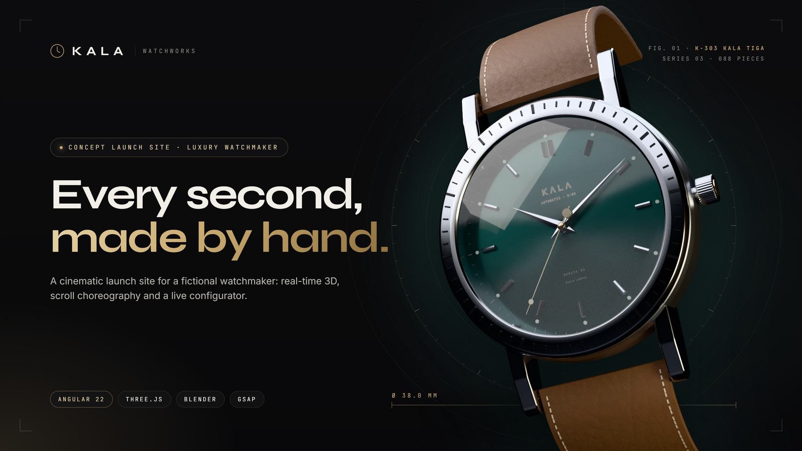
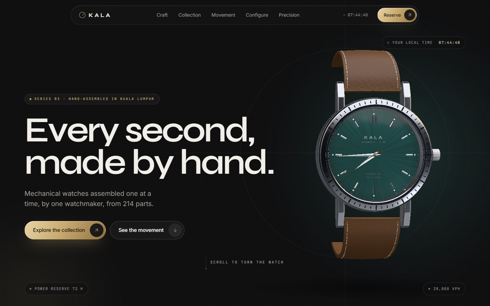
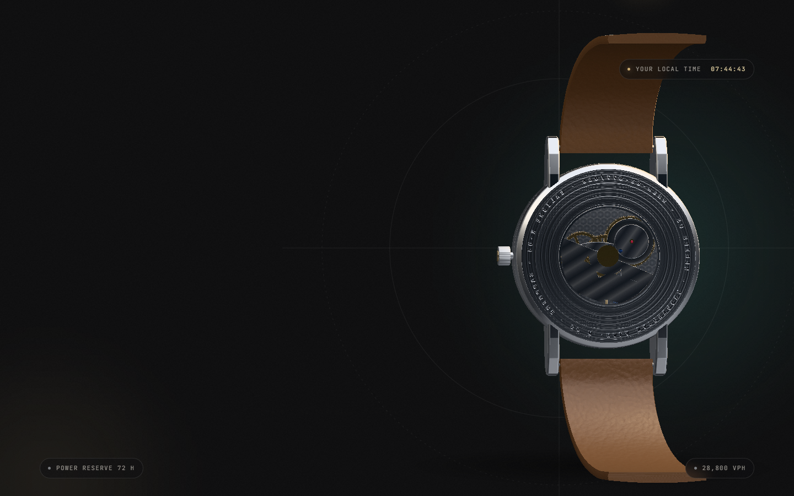
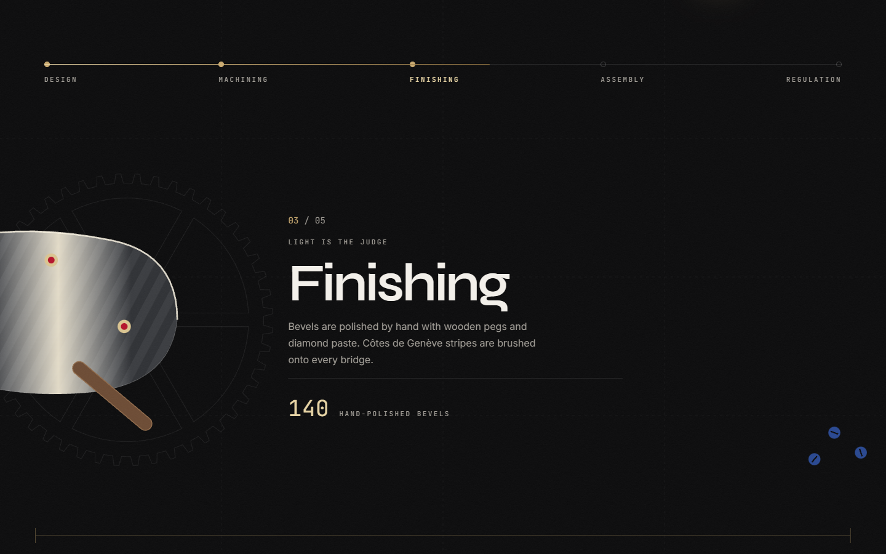
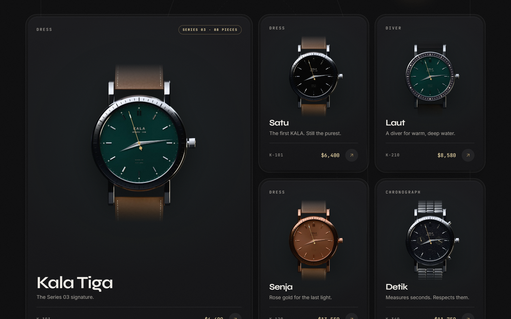
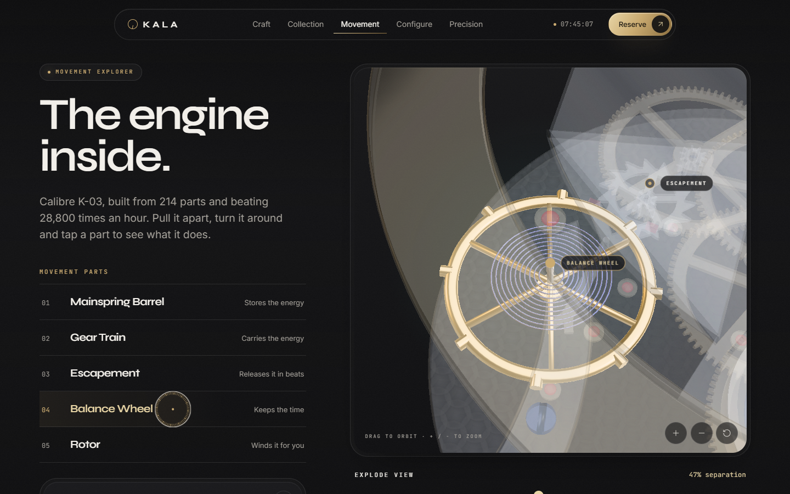
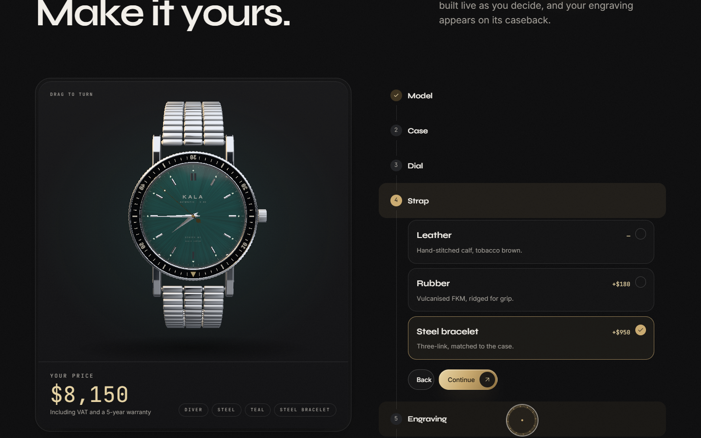
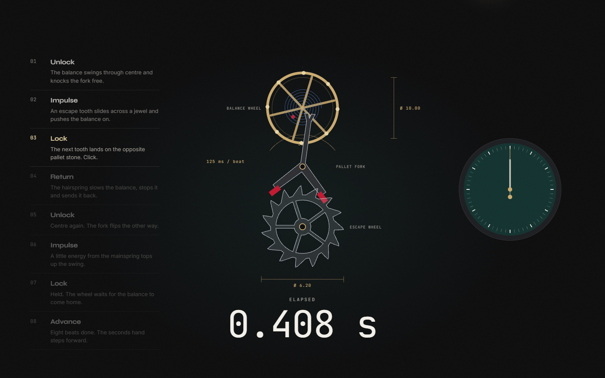

# KALA Watchworks




A cinematic, single-page launch site for **KALA Watchworks**, a fictional independent maker of mechanical watches. *Kala* means *time* in Malay. It is a frontend portfolio piece: dark-luxury art direction, real-time 3D, scroll choreography and interactive UI, **built with Angular 22** (standalone components, signals, zoneless change detection, `@defer`) and shipped as a prerendered static site.

> KALA Watchworks is a fictional brand created for a design portfolio. Every name, price and owner quote is invented.

**Live site:** add the deployed URL here after publishing (see [Deploy](#deploy)).



| | |
|---|---|
|  |  |
|  |  |
|  |  |

## Features

- **Preloader:** a watch face winds up with real loading progress, then dissolves into the hero.
- **Hero:** a Blender-modelled 3D watch showing your local time; scroll turns it to reveal the movement.
- **Release ticker:** a live countdown band that speeds up with scroll.
- **The Craft:** a pinned horizontal scroll through five stages, shown as Blender close-ups.
- **Collection:** filterable, 3D-tilt cards with studio renders, live hands and a detail gallery.
- **Movement Explorer:** an explodable 3D calibre with gears turning at true speeds and clickable parts.
- **Configurator:** a six-step builder with a live 3D preview, caseback engraving and animated price.
- **Precision in Numbers:** animated accuracy and power-reserve charts, plus count-up stats.
- **Anatomy of a Second:** one second slowed down across the scroll, tick by tick.
- **And more:** testimonial marquees, an accessible FAQ, a gold-dust final call to action, smooth scroll and a custom cursor.

## Tech stack

| Purpose | Library |
|---|---|
| Framework | Angular 22: standalone components, signals, zoneless change detection |
| Rendering | Angular SSG (`@angular/ssr`, `outputMode: 'static'`) with hydration and event replay |
| Styling | Tailwind CSS v4 + SCSS design tokens as CSS variables |
| 3D | Three.js, wrapped in plain classes (`src/app/three`) and driven from components; models built in Blender, Draco-compressed |
| Animation | GSAP + ScrollTrigger, SplitText, DrawSVG, Flip; native `animate.enter` / `animate.leave` |
| Smooth scroll | Lenis |
| UI primitives | Angular CDK (Dialog/Overlay, A11y, Accordion, Layout) and Angular Material (Stepper, Slider, Chips, Button Toggle, Snackbar) |
| Charts | Apache ECharts via `ngx-echarts` (only the used modules, lazy loaded) |
| Carousel | Swiper Element |
| Icons | Lucide (`@lucide/angular`) at an ultra-thin stroke |

`angular-three` does not yet support Angular 22 (its peer range ends below 22), so the 3D layer wraps raw Three.js in framework-agnostic scene classes, as the project brief allows.

## Why Angular for this project

KALA is a large, highly structured single page: 14 sections, a six-step configurator whose state drives a live 3D model, forms with validation, modals and two 3D scenes. Angular's opinionated structure (standalone components, DI services, directives) keeps that scale organized. **Signals** give fine-grained reactive state: one `ClockService` signal drives every clock face, and one `ConfiguratorStore` feeds both the price and the 3D preview, with no extra state library. **`@defer`** lazy-loads heavy 3D and chart sections by viewport with no manual code-splitting. The **CDK and Material** provide accessible overlays, steppers, sliders and focus management out of the box. **Built-in SSG** ships the site as fast static HTML. A lighter library would need several extra packages and conventions to match this.

## Built with modern Angular

The whole site is written in current, idiomatic Angular 22, with no NgModules, no Zone.js and no decorator inputs:

| Angular feature | Where it is used |
|---|---|
| **Zoneless change detection** | `provideZonelessChangeDetection()` in `app.config.ts`. Every update is driven by signals, so no Zone.js ships. |
| **Standalone components + `OnPush`** | All 36 components are standalone and `OnPush`. |
| **Signals: `signal`, `computed`, `linkedSignal`, `effect`** | `ClockService` (one ticking signal behind every clock face), `ConfiguratorStore` (price, serial and caseback view are `computed`; the strap is a `linkedSignal` that follows the model's default until you override it), `effect`s that push state into the 3D scenes. |
| **Signal APIs: `input()`, `model()`, `viewChild()`** | `input.required()` for component data, `model()` for two-way binding between the Movement Explorer parts list and its 3D stage, `viewChild`/`viewChildren` for DOM and canvas refs. |
| **`inject()`** | All dependency injection, with no constructor parameters. |
| **Built-in control flow** | `@if`, `@for` (always with `track`) and `@switch` everywhere. |
| **`@defer (on viewport; prefetch on idle)`** | Seven deferred blocks keep Three.js, ECharts, Swiper and the Material stepper out of the initial bundle, each with a skeleton `@placeholder`. The initial transfer is about 195 kB. |
| **SSG + hydration** | `@angular/ssr` with `outputMode: 'static'` prerenders the page to HTML; `provideClientHydration(withEventReplay())` replays clicks made before hydration. |
| **`afterNextRender` + `DestroyRef`** | Every browser-only effect (WebGL, GSAP, Lenis, pointer and timer code) starts after render and is torn down on destroy, so the prerender never touches `window`. |
| **Native `animate.enter` / `animate.leave`** | Enter and leave transitions without the deprecated `@angular/animations` package. |
| **Typed reactive forms** | The "Register interest" and newsletter forms, with custom validators in `shared/validators/`. |
| **Angular CDK + Material** | Dialog, focus trap, accordion and `BreakpointObserver` (via `toSignal`) from the CDK; stepper, slider, chips, button toggle and snackbar from Material, restyled to the KALA theme. |
| **Web Worker builder** | The studio lighting is prefiltered in `studio-environment.worker.ts`, bundled by the Angular CLI (`webWorkerTsConfig`). |

## Architecture

```
src/app/
  core/
    gsap.ts              one-time GSAP plugin registration
    services/            scroll (Lenis + ScrollTrigger), motion (reduced-motion signal), clock,
                         cursor, preload, configurator.store
  shared/
    directives/          appMagnetic, appTilt3d, appReveal, appSplitText, appParallax, appCountUp
    ui/                  button, dark-card, chip, section-heading, marquee, svg-watch-face,
                         svg-watch-view, watch-render, custom-cursor, guide-lines, odometer
    validators/          typed reactive-form validators
    utils/               SVG gear path helpers
  sections/              preloader, nav, hero, ticker, craft, collection, movement,
                         configurator, precision, anatomy, voices, faq, final-cta, footer
  three/
    scenes/              hero-scene (hero + configurator), movement-scene
    objects/             watch-model, calibre (shared kinematics), plus procedural fallbacks:
                         watch-case, dial, hands, strap, gear, balance-wheel, rotor
    utils/               assets (GLTF + Draco), studio-environment.worker, engraving-texture,
                         materials, gear-geometry, webgl
  data/                  every piece of visible copy, as typed constants
  styles/                tokens, typography, utilities, material-theme
art/                     Blender source (kala-watch.blend), CC0 textures, fonts,
                         thumbnail/ (source of docs/thumbnail.jpg)
public/models/           kala-watch.glb, kala-movement.glb (Draco + WebP)
public/renders/          collection product renders (WebP)
public/craft/            Craft section renders (WebP)
public/env/              studio.hdr (studio lighting)
public/draco/            Draco decoder
```

Key patterns:

- **One clock, every face.** `ClockService.now` ticks once per second, aligned to the real second boundary. The 3D hands, the SVG faces, the nav readout, the hero chip and the ticker countdown all derive from it.
- **One store, price and preview.** `ConfiguratorStore` holds signals for model, case, dial, strap and engraving. The strap is a `linkedSignal` that follows the model's default until the user overrides it. The price, serial and caseback view are `computed`. The 3D preview subscribes with `effect`s.
- **Deferred heavy sections.** Three.js, ECharts, Swiper and the Material stepper each land in lazy chunks through `@defer (on viewport)` with skeleton placeholders. The initial transfer is about 195 kB.
- **Browser-only code** runs in `afterNextRender`, so the prerender never touches `window`. Every GSAP context, ScrollTrigger, renderer, geometry, material, texture, interval and listener is released through `DestroyRef`.
- **One render loop per scene.** Each loop pauses when its canvas leaves the viewport or the tab is hidden, and pixel ratio is clamped to 2 or less.
- **No main-thread stalls from 3D.** The studio HDRI is prefiltered once in a Web Worker (OffscreenCanvas) and shared by every scene, and Draco geometry decodes in workers too. The models (≈1.2 MB in total) download behind the preloader. Shaders, including the sapphire's transmission variants, compile in parallel before the first frame, and scenes are built in small steps that yield to the browser.

- **Built for phones too.** Touch and low-power devices get a lighter 3D tier: pixel ratio capped at 1.5, no MSAA, a reflective crystal instead of the extra transmission pass, and smaller textures. On portrait screens the hero watch is framed into the measured space above the copy. Touch targets are at least 44 px on coarse pointers. Layouts are checked at 360, 390, 414, 768 and 1024 px with no horizontal overflow.

Measured with Lighthouse on a gzip-served static build:

| Preset | Performance | Accessibility | Best Practices | SEO |
|---|---|---|---|---|
| Desktop | 97–99 | 100 | 100 | 100 |
| Mobile (simulated mid-range phone, 4× CPU slowdown, slow 4G) | 50–62 | 100 | 100 | 100 |

The mobile lab score reflects start-up work that real-time 3D and scroll choreography need. Most of it runs while the preloader is showing, so scrolling afterwards stays smooth. Unthrottled, first paint lands at about 0.5 s.

## 3D pipeline (Blender)

Both 3D models are built in Blender 5.2 and live in `art/kala-watch.blend`:

- **`KALA_Watch`** holds the case, both bezels, crown, pushers, crystal, caseback, dials, indices, hands and all three straps. Every part the site animates or toggles is its own named object: the hands and crown pivot on their own origins, and variant parts are shown or hidden per model.
- **`KALA_Movement`** holds the calibre, grouped into explode layers (`layer_plate` … `layer_rotor`), named moving parts (`wheel_*`, `pallet_fork`, `balance_wheel`, `rotor`) and hotspot anchors (`anchor_*`). The same file drives the Movement Explorer and, scaled down, the movement behind the caseback.

The site keeps the live parts in code. Case and dial colours, the dial print, the diver insert numerals, bezel ticks and the caseback engraving are applied at runtime, so the configurator still recolours and engraves the modelled watch. If a model fails to load, the site falls back to the procedural watch and movement.

To update the models, edit the `.blend`, then export both collections to `art/export/` as glTF (+Y up). The watch is modelled with its dial facing +Z, so it is rotated 90° about X before export; the movement is already Y-up. Then run:

```bash
npm run models   # Draco geometry + WebP textures into public/models/
```

**Craft renders.** The five Craft images in `public/craft/` (1200 × 1000 plus 600 × 500 for phones, about 525 KB in total) come from the `KALA_Craft` scene in the same file, built by the `kala_craft.py` text block. It reuses the watch and movement meshes with close-up finishes of their own: a Côtes de Genève shader (arc-brushed bands with mirror-polished bevels), perlage (overlapping circular grains) and pegwood. It also adds modelled props: a drafting pencil with a knurled grip, a divider, a four-flute coated end mill, swarf and tweezers. To re-render, run `render(shot, f'cam_{shot}', path)` for each shot in `SHOTS`.

**Product renders.** The collection images in `public/renders/` (`{id}-front|back|side.webp`, 800 × 800, about 36 KB each) come from the same file. The `kala_shots.py` text block in the `.blend` configures each of the eight references (case finish, dial, strap, bezel, dial print, caseback engraving) and renders it in Cycles with a transparent background. Each view has its own light rig, and the side view uses an anti-reflective crystal so the dial stays readable at a grazing angle. The front view is rendered without hands. `WatchRenderComponent` draws live hands on top at the render's own scale: the orthographic camera frames 3.3 model units across the image. To re-render, run `shoot(watch, out_dir)` from that script in Blender's Python console, then copy the files into `public/renders/`.

## Accessibility and motion

- `prefers-reduced-motion` disables smooth scroll, pinning, parallax, marquees, the preloader and 3D auto-motion, and shows final states instantly. The clock still ticks.
- Every control is keyboard reachable, with a gold focus ring. The dialog and mobile menu trap focus and restore it on close. Configurator choices are real radio groups. Hotspots are real buttons.
- 3D canvases are `aria-hidden` and described in nearby text. Landmarks use `header`, `nav`, `main`, `section[aria-labelledby]` and `footer`.

## Commands

```bash
npm install
npm start                    # ng serve, dev server on http://localhost:4200
npm run build                # production build + prerendered static output in dist/kala/browser
npm run preview              # npx serve dist/kala/browser
npm test                     # unit tests (Vitest)
```

Unit tests cover the `ConfiguratorStore` price logic (including every collection price), the `ClockService` hand-angle maths and ticking, the form validators, the escapement timing and the release countdown.

## Deploy

The build output in `dist/kala/browser` is plain static files. You can publish it to any static host:

- **Vercel / Netlify:** build command `npm run build`, output directory `dist/kala/browser`.
- **GitHub Pages:** build with `npx ng build --base-href /<repo-name>/`, then publish `dist/kala/browser`.

After the first deploy, change `og:image` in `src/index.html` to the full URL (for example `https://your-domain/og-image.jpg`) so link previews show the thumbnail, and add the live URL at the top of this README.

## Portfolio thumbnail

`docs/thumbnail.jpg` (1920 × 1080) and `docs/thumbnail@2x.jpg` (3840 × 2160) are the 16:9 project thumbnails, and `public/og-image.jpg` (1200 × 675) is the social preview. They come from `art/thumbnail/thumbnail.html`, which lays a Cycles render of the Blender watch over the site's own type, colours and technical-drawing lines.

## Credits

Designed & built by Wan Amirul Amir bin Wan Romzi. Fonts: Syne, Inter and JetBrains Mono (Google Fonts). All watches, people and prices are fictional.

3D assets: watch and movement modelled for this project in Blender. Studio lighting from [Wooden Studio 15](https://polyhaven.com/a/wooden_studio_15) by Alexander Scholten, and leather grain from [Leather Red 02](https://polyhaven.com/a/leather_red_02) by Rob Tuytel, both via Poly Haven (CC0).

## License

Code released under the [MIT License](LICENSE.md) © 2026 Wan Amirul Amir bin Wan Romzi. Fonts, Poly Haven assets and the Draco decoder keep their own licences, listed in [LICENSE.md](LICENSE.md#third-party-assets).
